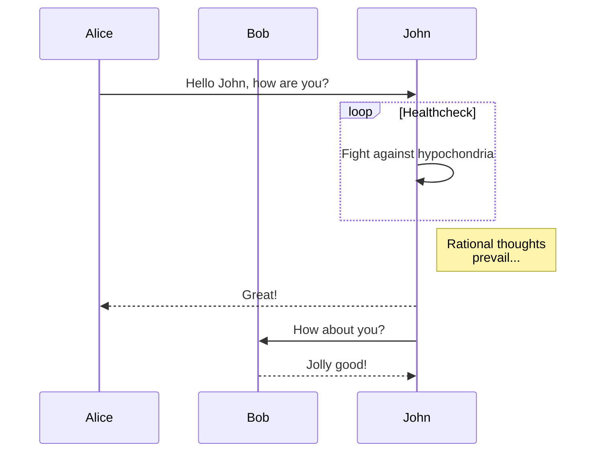

## 前言

实验

<p class="success">状态提示消息 - Success</p>
<p class="warn">警告提示消息 - Warn</p>
<p class="error">错误提示消息 - Error</p>

支持深色模式，MacOS 下会自动变色

## 数学公式测试

$$f(x) = a_1x^n + a_2x^{n-1} + a_3x^{n-2}$$

## mermaid测试



## 代码测试

```golang
func (r *raftNodePersister) ReadByBytes(b []byte) error {
	if err := gob.NewDecoder(bytes.NewBuffer(b)).Decode(r); err != nil {
		return err
	}
	return nil
}

func (r *raftNodePersister) WriteByBytes() ([]byte, error) {
	var buf bytes.Buffer
	if err := gob.NewEncoder(&buf).Encode(r); err != nil {
		return nil, err
	}
	return buf.Bytes(), nil
}
```
