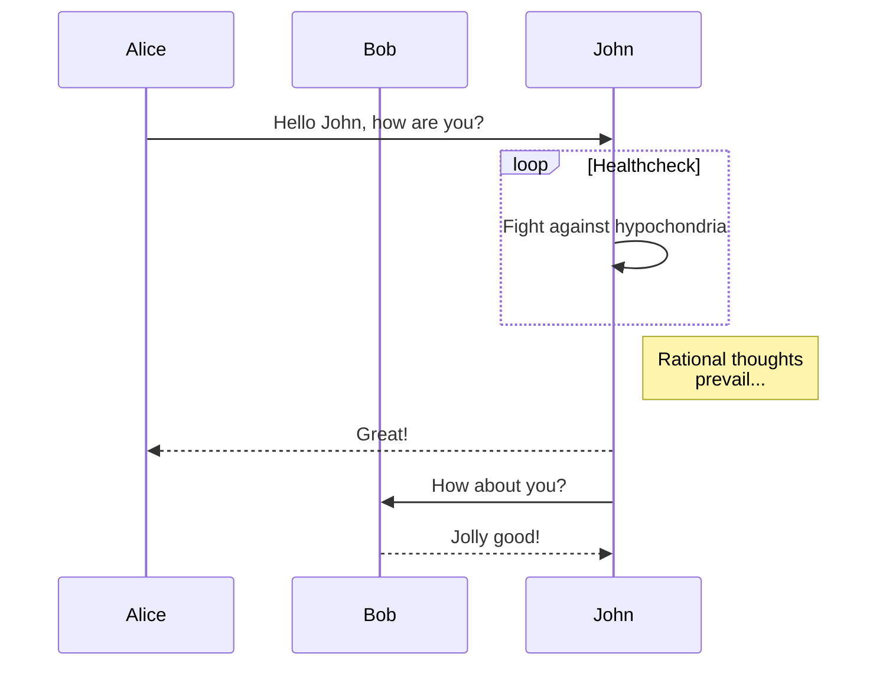

## 前言

实验，全部支持暗黑主题^[包括图表也是支持的。]。

<p class="success">状态提示消息 - Success</p>
<p class="warn">警告提示消息 - Warn</p>
<p class="error">错误提示消息 - Error</p>

支持深色模式，MacOS 下会自动变色

## 数学公式测试

$$f(x) = a_1x^n + a_2x^{n-1} + a_3x^{n-2}$$

## mermaid测试



## EBNF测试

```ebnf
grammar = { rule } ;
rule = lhs , "=" , rhs , ";" ;
lhs = identifier ;
rhs = identifier
     | terminal
     | "[" , rhs , "]"
     | "{" , rhs , "}"
     | "(" , rhs , ")"
     | rhs , "|" , rhs
     | rhs , "a"
     | rhs , "," , rhs ;
identifier = letter , { letter | digit | "_" } ;
terminal = "'" , character , { character } , "'"
         | '"' , character , { character } , '"' ;
character = letter | digit | symbol | "_" ;
letter = "A" | "B" | "C" | "D" | "E" | "F" | "G"
       | "H" | "I" | "J" | "K" | "L" | "M" | "N"
       | "O" | "P" | "Q" | "R" | "S" | "T" | "U"
       | "V" | "W" | "X" | "Y" | "Z" | "a" | "b"
       | "c" | "d" | "e" | "f" | "g" | "h" | "i"
       | "j" | "k" | "l" | "m" | "n" | "o" | "p"
       | "q" | "r" | "s" | "t" | "u" | "v" | "w"
       | "x" | "y" | "z" ;
digit = "0" | "1" | "2" | "3" | "4" | "5" | "6" | "7" | "8" | "9" ;
symbol = "[" | "]" | "{" | "}" | "(" | ")" | "<" | ">"
       | "'" | '"' | "=" | "|" | "." | "," | ";" ;
```

```ebnf
letter = "A" | "B" | "C" | "D" | "E" | "F" | "G"
       | "H" | "I" | "J" | "K" | "L" | "M" | "N"
       | "O" | "P" | "Q" | "R" | "S" | "T" | "U"
       | "V" | "W" | "X" | "Y" | "Z" | "a" | "b"
       | "c" | "d" | "e" | "f" | "g" | "h" | "i"
       | "j" | "k" | "l" | "m" | "n" | "o" | "p"
       | "q" | "r" | "s" | "t" | "u" | "v" | "w"
       | "x" | "y" | "z" ;
digit = "0" | "1" | "2" | "3" | "4" | "5" | "6" | "7" | "8" | "9" ;
symbol = "[" | "]" | "{" | "}" | "(" | ")" | "<" | ">"
       | "'" | '"' | "=" | "|" | "." | "," | ";" ;
```

## 代码测试

```golang
func (r *raftNodePersister) ReadByBytes(b []byte) error {
	if err := gob.NewDecoder(bytes.NewBuffer(b)).Decode(r); err != nil {
		return err
	}
	return nil
}

func (r *raftNodePersister) WriteByBytes() ([]byte, error) {
	var buf bytes.Buffer
	if err := gob.NewEncoder(&buf).Encode(r); err != nil {
		return nil, err
	}
	return buf.Bytes(), nil
}
```
